# Project học phần PTUD Di động (CT484)

Học kỳ 2, Năm học 2022-2023

**MSSV 1** : B1910192

**Họ tên SV 1**: Hà Ngọc Châu

**MSSV 2**: B1910325

**Họ tên SV 2**: Nguyễn Nhật Trường

**Lớp học phần**: CT484_02

**Tên dự án**: Ứng dụng bán phụ kiện máy tính

 ## Bảng phân công công việc
 
|          Nguyễn Nhật Trường               |            Hà Ngọc Châu               |
| :----------------------------------------:|:-------------------------------------:|
|     Giao diện giới thiệu ứng dụng         |    Giao diện trang chủ                |
|     Giao diện đăng nhập / đăng ký         |    Giao diện xem tất cả sản phẩm      |
|     Giao diện xác nhận đơn hàng           |    Giao diện chi tiết sản phẩm        |
|     Giao diện tài khoản                   |    Giao diện giỏ hàng                 |
|     Giao diện xem đơn hàng đã đặt         |    Giao diện tìm kiếm                 |
|     Giao diện quản lý của admin           |    Giao diện xem sản phẩm yêu thích   |

## Contents:
  - [Giao diện giới thiệu ứng dụng 💫](#onboard)
  - [Giao diện đăng ký / đăng nhập 🛡](#login-signup)
  - [Giao diện trang chủ 🏠](#home)
  - [Giao diện xem tất cả sản phẩm 📰](#all-prod)
  - [Giao diện chi tiết sản phẩm 🗒](#detail-prod)
  - [Giao diện giỏ hàng ️🛒 ](#cart)
  - [Giao diện xác nhận đơn hàng 📝](#confirm-order)
  - [Giao diện tài khoản 👤](#account)
  - [Giao diện tìm kiếm 🔍](#search)
  - [Giao diện xem sản phẩm yêu thích 💓](#favorite-prod)
  - [Giao diện xem đơn hàng đã đặt 📜](#orders)
  - [Giao diện quản lý của admin 👨🏽‍💻](#prod-management)
  
## JSon Structure on Firebase:
  - [products 🔥](#jsproducts)
  - [userFavorites 🔥](#jsuser-favorites)
  - [orders 🔥](#jsorders)

### Giao diện giới thiệu ứng dụng 💫 

    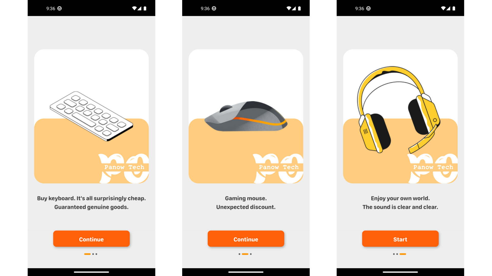

### Giao diện đăng ký / đăng nhập 🛡 

    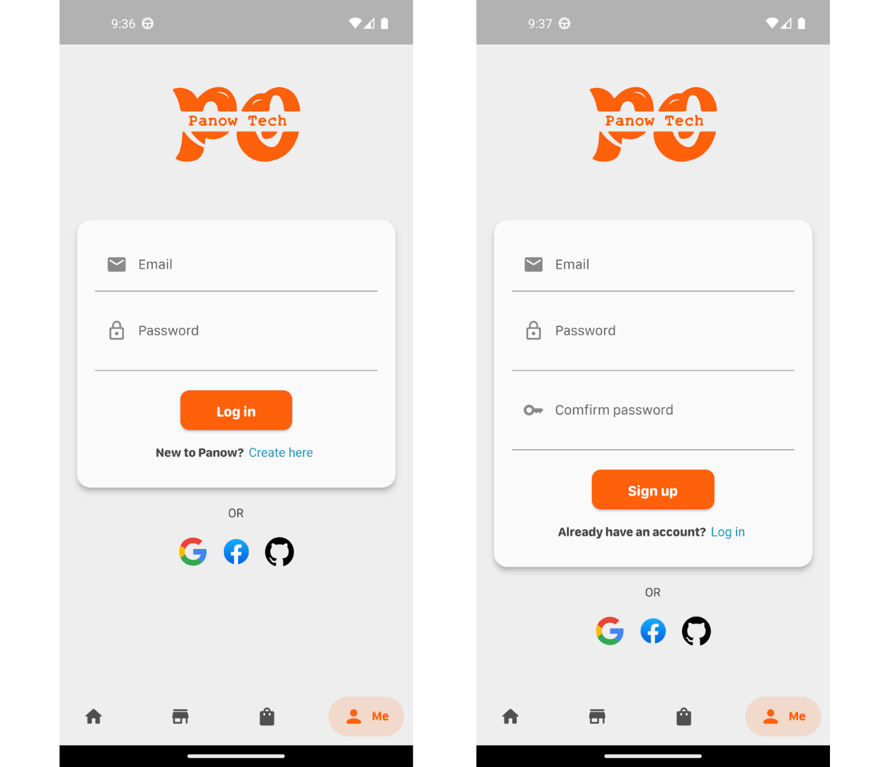

### Giao diện trang chủ 🏠 

    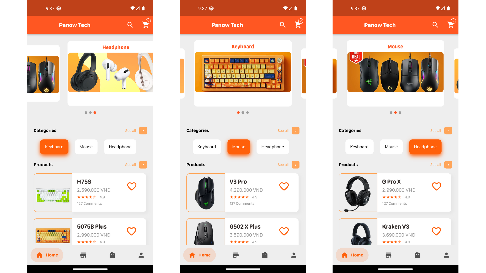

### Giao diện xem tất cả sản phẩm 📰

    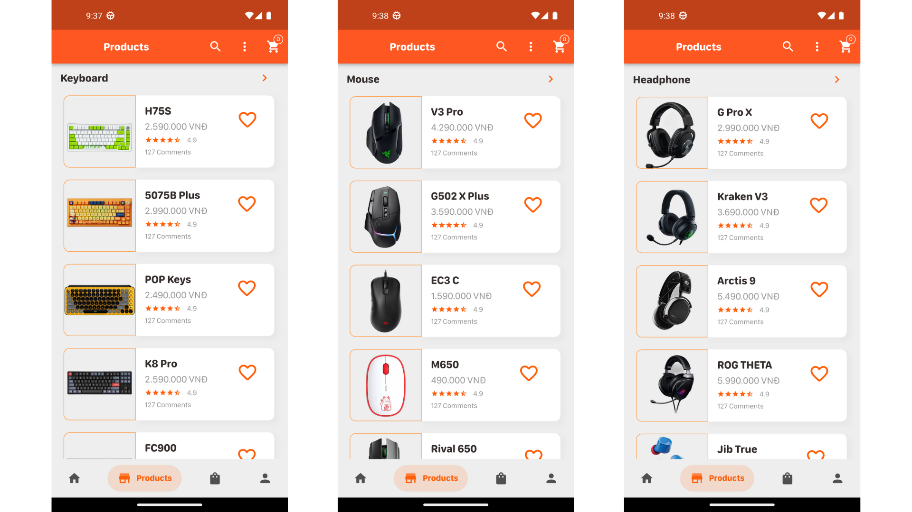

### Giao diện chi tiết sản phẩm 🗒 

    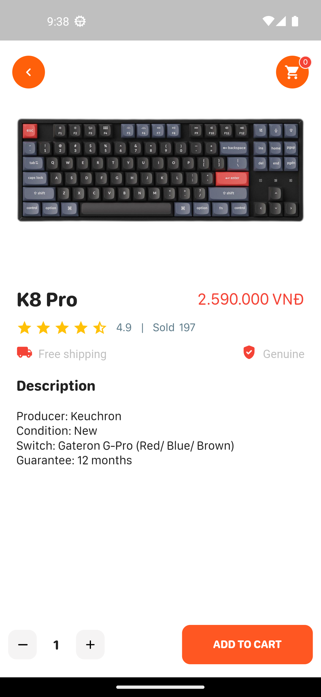

### Giao diện giỏ hàng ️🛒 

    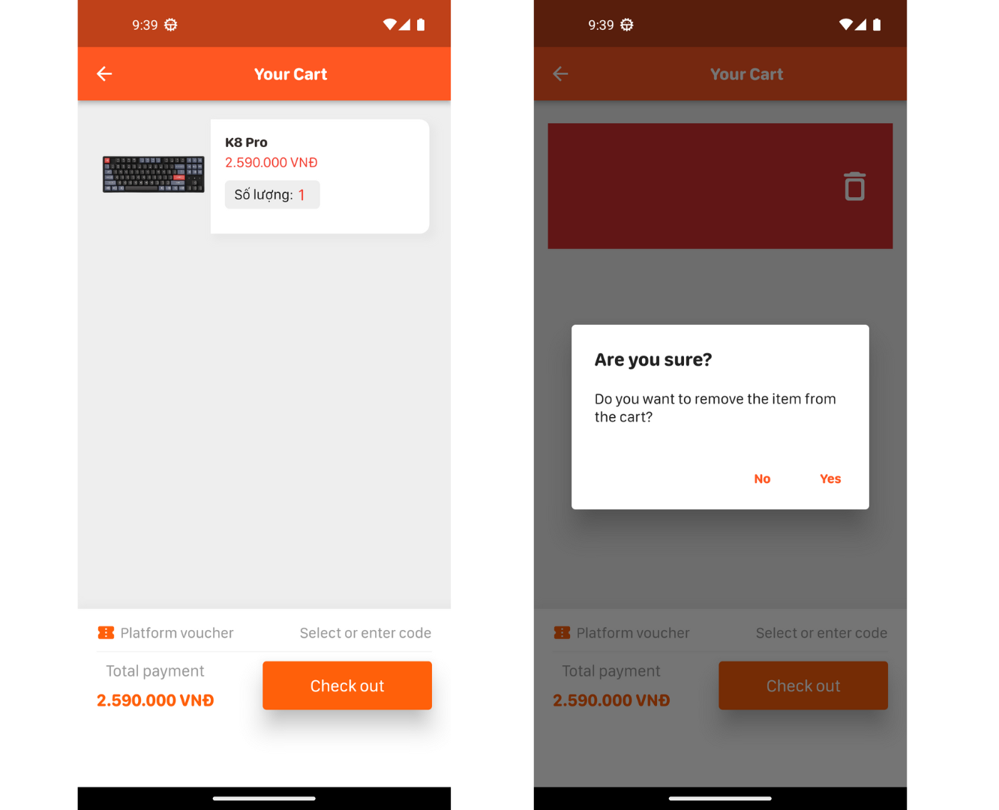

### Giao diện xác nhận đơn hàng 📝 

    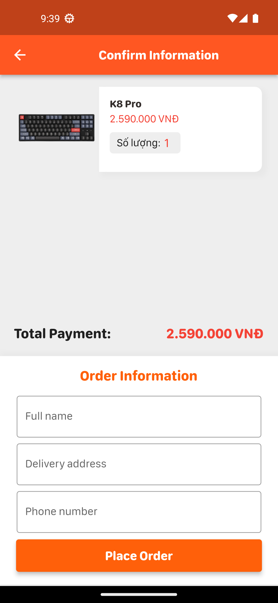

### Giao diện tài khoản 👤 

    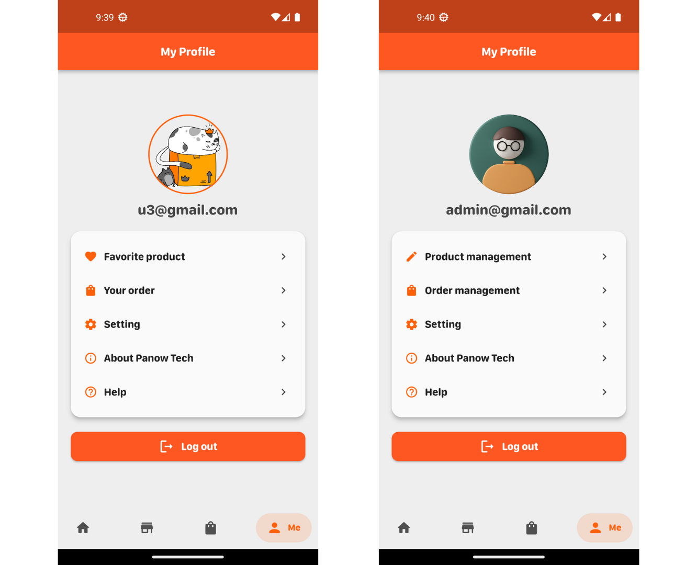

### Giao diện tìm kiếm 🔍 

    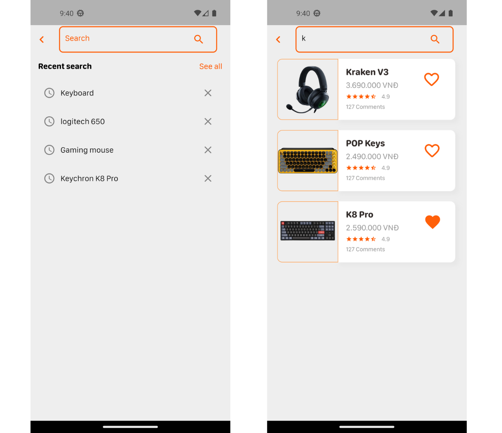

### Giao diện xem sản phẩm yêu thích 💓 

    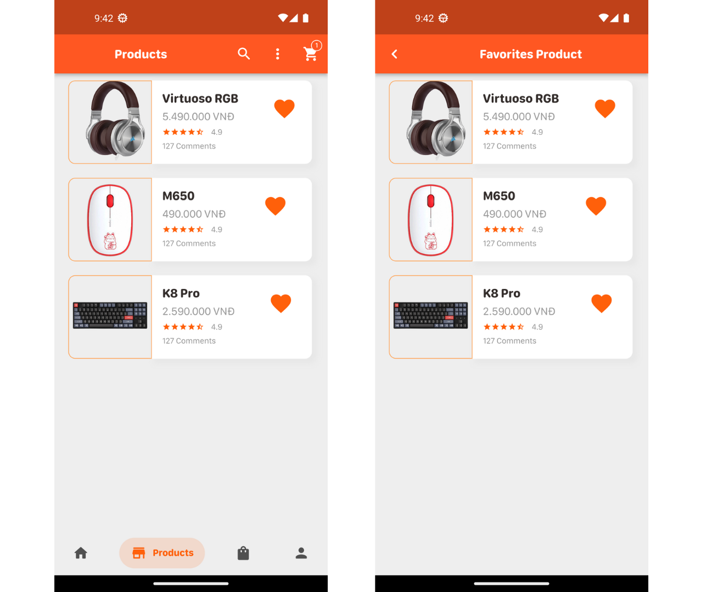

### Giao diện xem đơn hàng đã đặt 📜 

    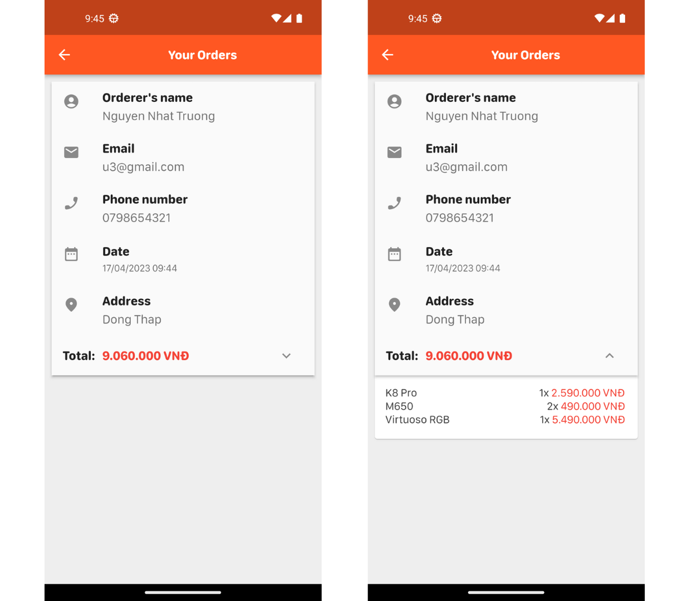

### Giao diện quản lý của admin 👨🏽‍💻 

    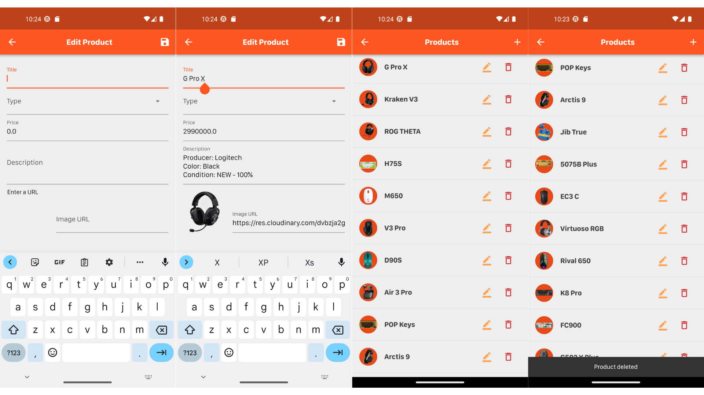

### Cấu trúc JSon của products 🔥

    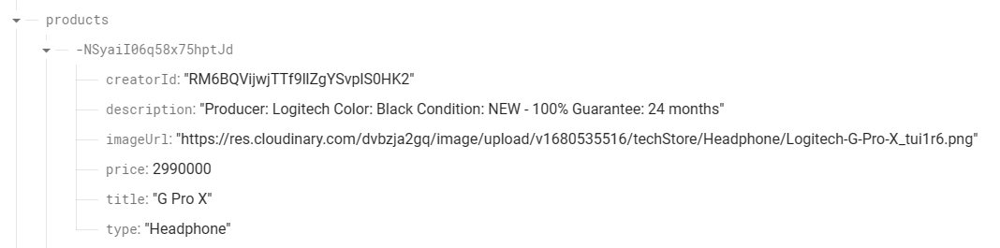

### Cấu trúc JSon của userFavorites 🔥

    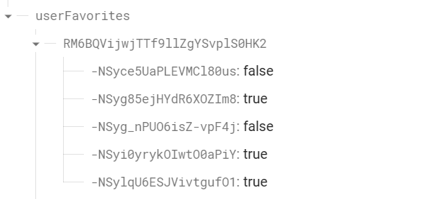

### Cấu trúc JSon của orders 🔥

    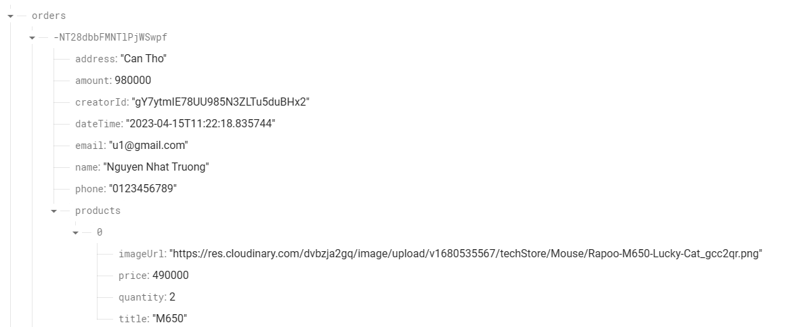

